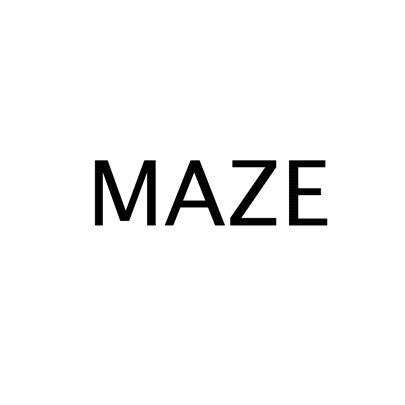

**M**ultiscale **A**tomic **Z**eolite Simulation **E**nvironment (**MAZE**)
========================================================


Introduction
===============
This project aims to extend the Atomic Simulation Environment (ASE) to more naturally represent zeolites and facilitate the calculations required to determine their properties. 

The `Zeolite` class, which contains the majority of the functionality of the MAZE code, inherits from the `ase.Atoms` class and thus contains all of the `ase.Atoms` class' familiar features and behaviors. The `Zeolite` class also has additional features that simplify the tracking of relationships between atoms in related zeolite structures. 

A detailed and complete description of the features of the MAZE code can be found in the [official MAZE documentation](https://kul-group.github.io/MAZE-sim/). 


Installation 
=================
The current stable, release of MAZE (0.1.0) can now be installed via `pip` using the command 
`pip install maze-sim`.
 
The most recent developer version of the MAZE code is available on Github. To install it follow the following instructions: 
 
1. Clone this git repository 
    ``` 
    git clone https://github.com/kul-group/MAZE-sim.git
    ```
2. Navigate into the cloned directory 
    ```
    cd MAZE-sim
    ```
3. Install the package with pip
    ```
    pip install . 
    ```
4. Verify the package is installed by running a python shell and importing the ``maze`` package. 
    ```
    python
   >>> import maze 
   >>> maze.Zeolite() 
   Zeotype(symbols='', pbc=False)
    ```
Documentation 
==============
For complete class descriptions and tutorials check out the [official MAZE documentation](https://kul-group.github.io/MAZE-sim/). 

Features 
=======

- Complete compatibility with the Atomic Simulation Environment (ASE)
- Automatic site labeling when building from CIF files from the iza structure database  
- Automatic downloading of CIF files from the IZA database
- Atom relationship tracking across related zeolite structures
- Simple atom capping and uncapping 
- Simple cluster extraction and cluster reintegration  
-	Interface for adding adsorbates, automatically positioning adsorbates and removing adsorbates 
- Save collections of Zeolites and reload them while preserving their atomic relationships 
- Single Al replacement for all unique T-sites
- Get all unique Al pairs within some pre-defined distance cutoff
- Extra-framework atoms insertion around each Al sites, Z-TM, Z-H; easily extendable to Z-XX, XX being -CO, -OH, -OOH, etc.
- Extra-framework atoms insertion and positioning in between pair sites, allowing user-defined extra-framework atom types, such as TM, TM oxides, OSDA, etc.
- Automated folder generation and output structure saving


Contribute
----------

- Discussion Board: https://github.com/kul-group/MAZE-sim/discussions
- Source Code: https://github.com/kul-group/MAZE-sim
- Issue Tracker: https://github.com/kul-group/MAZE-sim/issues

Changelog
---------
Version 0.1.1
* Added translate_self and wrap_self methods to Zeolite class
* Added apply function to allow the application of arbitrary functions to Zeolite objects
* Added new tutorial on optimization
* Added support for loading in optimized structures 
* Made test cases stricter
* Created an ExtraFrameworkAnalyzer class


Support
-------

If you are having issues, please let us know by posting on the [discussion board](https://github.com/kul-group/MAZE-sim/discussions). You can also submit an issue to the [Issue Tracker](https://github.com/kul-group/MAZE-sim/issues) if you encounter a specific, code related problem.  

License
-------

Copyright 2021 Dexter Antonio

Permission is hereby granted, free of charge, to any person obtaining a copy of this software and associated documentation files (the "Software"), to deal in the Software without restriction, including without limitation the rights to use, copy, modify, merge, publish, distribute, sublicense, and/or sell copies of the Software, and to permit persons to whom the Software is furnished to do so, subject to the following conditions:

The above copyright notice and this permission notice shall be included in all copies or substantial portions of the Software.

THE SOFTWARE IS PROVIDED "AS IS", WITHOUT WARRANTY OF ANY KIND, EXPRESS OR IMPLIED, INCLUDING BUT NOT LIMITED TO THE WARRANTIES OF MERCHANTABILITY, FITNESS FOR A PARTICULAR PURPOSE AND NONINFRINGEMENT. IN NO EVENT SHALL THE AUTHORS OR COPYRIGHT HOLDERS BE LIABLE FOR ANY CLAIM, DAMAGES OR OTHER LIABILITY, WHETHER IN AN ACTION OF CONTRACT, TORT OR OTHERWISE, ARISING FROM, OUT OF OR IN CONNECTION WITH THE SOFTWARE OR THE USE OR OTHER DEALINGS IN THE SOFTWARE.
