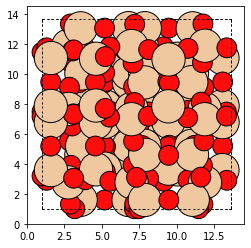
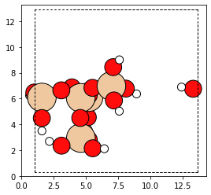
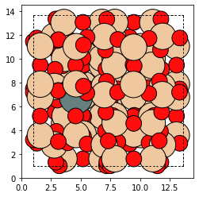
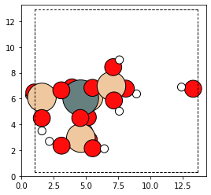
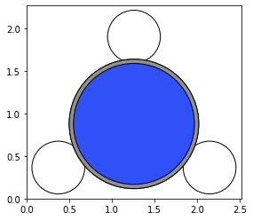
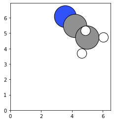
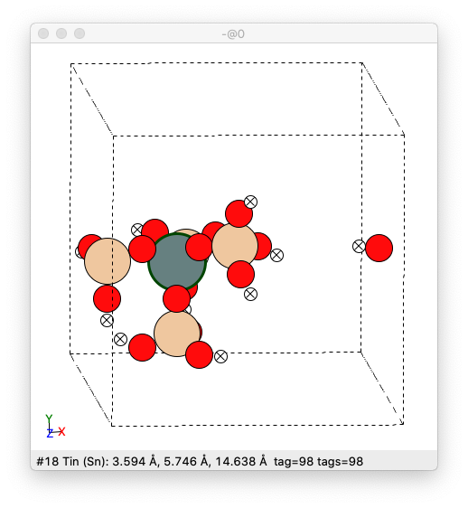
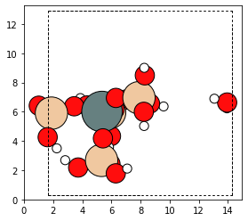
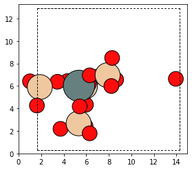
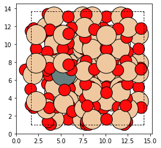

Optimization Tutorial
=====================

This Jupyter notebook goes through the procedure for extracting a
cluster, capping the extracted cluster, adding an adosrbate to the
cluster, optimizing the cluster, uncapping the cluster and reintegrating
the cluster into the starting zeolite. \***\*

Import Required Packages
~~~~~~~~~~~~~~~~~~~~~~~~

.. code:: python

    from maze import Zeolite

.. code:: python

    import matplotlib.pyplot as plt
    from ase.visualize.plot import plot_atoms
    from ase import io
    import matplotlib.pyplot as plt

--------------

Overview
~~~~~~~~

One of the most useful features of the MAZE package is the ability to
add and remove atoms from a ``Zeolite`` object. To demonstrate this, we
will extract a cluster from an ``Zeolite`` object, optimize the cluster,
and then integrate it back into the main ``Zeolite``.

First, we make a bea_zeolite object with the ``Zeolite`` class’ static
``make`` method.

.. code:: python

    bea_zeolite = Zeolite.make('BEA')
    plot_atoms(bea_zeolite)

The next step is to pick a T-site to build the cluster around.

The atom with the index ``154`` is in the middle of the zeolite, which
will make viewing the cluster creation easy. One could also use the
``site_to_atom_indices`` dictionary to select a specific T site.

The Zeolite object uses an internal ``ClusterMaker`` object to select a
cluster from the Zeolite.

By default, a ``DefaultClusterMaker`` object is used. This
``DefaultClusterMaker`` object has a ``get_cluster_indices`` method
which uses the ``get_oh_cluster_indices`` function to selects the
indices of the central T atom, and surrounding oxygens and hydrogens.
There are other cluster functions available in the source code of
``DefaultClusterMaker``. If you need some different functionality,
simply make your own ``ClusterMaker`` class and set the
``Zeolite.cluster_maker`` attribute to an instance of your custom
cluster maker.

Let’s call our ``bea_zeolite``\ ’s ``ClusterMaker`` object’s
``get_cluster_indices`` method, to see what indices it will select.

.. code:: python3

    site = 154 
    cluster_indices = bea_zeolite.cluster_maker.get_cluster_indices(bea_zeolite, site)
    print(cluster_indices)

    [2, 66, 74, 138, 77, 82, 146, 22, 154, 30, 38, 102, 186, 42, 174, 50, 114, 117, 118, 58, 126]

These are the indices of the atoms that will make up the resulting
cluster and the indices of the atoms that will be absent in the open
defect zeolite.

We can now make the cluster and open defect zeolites by using the
``get_cluster`` method.

.. code:: python3

    cluster, od = bea_zeolite.get_cluster(154)

The cluster looks like this

.. code:: python3

    plot_atoms(cluster)

.. image:: output_14_1.png

the open defect looks like this

.. code:: python3

    plot_atoms(od)

.. image:: output_16_1.png

Both the open defect and the cluster are ``Zeolite`` objects, yet they
have a different ztype attribute

.. code:: python3

    display(type(bea_zeolite))
    display(type(od))
    display(type(cluster))

.. parsed-literal::

    maze.zeolite.Zeolite
    maze.zeolite.Zeolite
    maze.zeolite.Zeolite

.. code:: python3

    display(bea_zeolite.ztype)
    display(od.ztype)
    display(cluster.ztype)

.. parsed-literal::

    'Zeolite'
    'Open Defect'
    'Cluster'

Next, we want to cap the cluster and apply changes to some of the
internal atoms. Capping involves adding hydrogens and oxygens to the
cluster. The built-in ``cap_atoms()`` method returns a new cluster
object that has hydrogen caps added to it.

.. code:: python

    capped_cluster = cluster.cap_atoms()
    plot_atoms(capped_cluster)

--------------

Adding Adsorbates
~~~~~~~~~~~~~~~~~

Adsorbates are frequently added to Zeolites for adsorption and probing
experiments. In this section an adsorbate as added to one of the T-sites
in the capped cluster.

We want the adsorbate to be positioned near the central T site. This T
site is at ``154`` in the original index, but the indices are different
in the cluster. Thankfully MAZE makes mapping the parent ``154`` index
to the cluster easy with the ``index_mapper.get_index`` function.

The ``index_mapper.get_index`` function takes three arguments the
“sender” name, which corresponds to the name of the Zeolite that you
know the index of, the “receiver” name, which is the zeolite whose atom
you want to know the index of, and the sender index, which is the index
that you know.

For example, to get the capped_cluster central T site index, knowing
that the that T site in the parent zeolite had index is 154 we use the
following command.

.. code:: python

    capped_cluster.index_mapper.get_index(capped_cluster.parent_zeotype.name, capped_cluster.name, 154)

.. parsed-literal::

    18

This is a little wordy, but it works. We can also use the
``site_to_atom_indices`` dictionary to see the idenity of all of the
sites in the capped cluster.

.. code:: python

    capped_cluster.atom_indices_to_sites[18]

.. parsed-literal::

    'T4'

To add an adsorbate to the cluster, we need an electrophiles atom in
place of the Silicon. We make this substitution here using the indices
we found in both the parent zeolite and the current zeolite.
Substitutions do not change the index mapper and are not tracked since
the indices are not shifted by substitutions.

.. code:: python

    capped_cluster.parent_zeotype[154].symbol = 'Sn' # replace original zeolite 154 site Si -> Sn
    capped_cluster[18].symbol = 'Sn' # replace site in the capped_cluster
    plot_atoms(capped_cluster.parent_zeotype)

.. code:: ipython3

    plot_atoms(capped_cluster)

The next stage involves creating an ``Adsorbate`` object. The
``Adsorbate`` class inherits from the ``ase.Atoms`` class, and includes
some additional functionality related to the positioning of the
``Adsorbate``.

The important parameters are the name and the “host_zeotype”. The host
zeotype is the zeolite where the adsorbate will be positioned. The
adsorbate code works best when the original framework is used as the
host zeotype, since it takes into consideration the containment provided
by the entire framework.

.. code:: python

    from maze.adsorbate import Adsorbate
    from ase.build import molecule
    ch3cn = molecule('CH3CN')
    ch3cn = Adsorbate(ch3cn, host_zeotype=capped_cluster.parent_zeotype, name='acetonitrile')
    plot_atoms(ch3cn)

The Adsorbate class inherits from the ase.Atoms class and thus can be
used with ASE’s visualization tools

To position the adsorbate, we need to find the index of the nucleophile
(i.e. the nitrogen)

.. code:: python

    for atom in ch3cn:
        print(atom.index, atom.symbol)

.. parsed-literal::

    0 C
    1 C
    2 N
    3 H
    4 H
    5 H

The donor atom is the N; thus, we note the index = 2. We could also find
this in one step with list comprehension.

.. code:: python

    nitrogen_index = [atom.index for atom in ch3cn if atom.symbol == 'N'][0]
    nitrogen_index

.. parsed-literal::

    2

.. code:: python

    #lets position the adsorbate (run this a few times until it works) 
    for _ in range(10):
        try:
            ch3cn = ch3cn.position_ads(donor_ind=nitrogen_index, host_ind=154)
            break
        except AssertionError:
            pass
    plot_atoms(ch3cn)

Now let’s integrate the adsorbate into the cluster. We will use the
integrate adsorbate function for this. Notice that the host_zeotype
doesn’t have to be the capped cluster for the integration to take place.
This integrate-adsorbate method also returns a new cluster object and a
new adsorbate object.

.. code:: python

    cluster_with_ads, ch3cn_in = capped_cluster.integrate_adsorbate(ch3cn)

We can now view the ``cluster_with_ads object``. The positioning will
not be perfect, since it relies on some very simple heuristics, but it
is a good initial guess for the calculations.

.. code:: python

    plot_atoms(cluster_with_ads)

Optimization
~~~~~~~~~~~~

The next stage of this process is optimizing the cluster. Note in the
current iteration, we do not optimize the cluster and adsorbate
together, but in future work this might take place.

Freezing Atom Caps
~~~~~~~~~~~~~~~~~~

To perform an optimization, we need to freeze the hydrogen atoms. ASE
has built in functions for this purpose, but we need to know the indices
of the caps. The indices for all of the atoms and their relationship
between each other are stored in the Index Mapper’s main index. In the
program, the main index consists of a series of nested dictionaries, but
it can easily be visualized by turning it into a Pandas Data Frame.
Pandas is not a required package for MAZE so the following line of code
is not wrapped in a nice function.

.. code:: python

    import pandas as pd
    from IPython.core.display import HTML

.. code:: python

    HTML(pd.DataFrame(cluster_with_ads.index_mapper.main_index).to_html())

.. raw:: html
    <head>
    <meta name="viewport" content="width=device-width, initial-scale=1">
    
    </head>
    <body>

    

    <table border="1" class="dataframe" background-color="#f2f2f2" padding="8px" border-collapse="collapse" border-spacing="0" width="100%" border="1px solid #ddd">
      <thead>
        <tr style="text-align: right;">
          <th></th>
          <th>0</th>
          <th>1</th>
          <th>2</th>
          <th>3</th>
          <th>4</th>
          <th>5</th>
          <th>6</th>
          <th>7</th>
          <th>8</th>
          <th>9</th>
          <th>10</th>
          <th>11</th>
          <th>12</th>
          <th>13</th>
          <th>14</th>
          <th>15</th>
          <th>16</th>
          <th>17</th>
          <th>18</th>
          <th>19</th>
          <th>20</th>
          <th>21</th>
          <th>22</th>
          <th>23</th>
          <th>24</th>
          <th>25</th>
          <th>26</th>
          <th>27</th>
          <th>28</th>
          <th>29</th>
          <th>30</th>
          <th>31</th>
          <th>32</th>
          <th>33</th>
          <th>34</th>
          <th>35</th>
          <th>36</th>
          <th>37</th>
          <th>38</th>
          <th>39</th>
          <th>40</th>
          <th>41</th>
          <th>42</th>
          <th>43</th>
          <th>44</th>
          <th>45</th>
          <th>46</th>
          <th>47</th>
          <th>48</th>
          <th>49</th>
          <th>50</th>
          <th>51</th>
          <th>52</th>
          <th>53</th>
          <th>54</th>
          <th>55</th>
          <th>56</th>
          <th>57</th>
          <th>58</th>
          <th>59</th>
          <th>60</th>
          <th>61</th>
          <th>62</th>
          <th>63</th>
          <th>64</th>
          <th>65</th>
          <th>66</th>
          <th>67</th>
          <th>68</th>
          <th>69</th>
          <th>70</th>
          <th>71</th>
          <th>72</th>
          <th>73</th>
          <th>74</th>
          <th>75</th>
          <th>76</th>
          <th>77</th>
          <th>78</th>
          <th>79</th>
          <th>80</th>
          <th>81</th>
          <th>82</th>
          <th>83</th>
          <th>84</th>
          <th>85</th>
          <th>86</th>
          <th>87</th>
          <th>88</th>
          <th>89</th>
          <th>90</th>
          <th>91</th>
          <th>92</th>
          <th>93</th>
          <th>94</th>
          <th>95</th>
          <th>96</th>
          <th>97</th>
          <th>98</th>
          <th>99</th>
          <th>100</th>
          <th>101</th>
          <th>102</th>
          <th>103</th>
          <th>104</th>
          <th>105</th>
          <th>106</th>
          <th>107</th>
          <th>108</th>
          <th>109</th>
          <th>110</th>
          <th>111</th>
          <th>112</th>
          <th>113</th>
          <th>114</th>
          <th>115</th>
          <th>116</th>
          <th>117</th>
          <th>118</th>
          <th>119</th>
          <th>120</th>
          <th>121</th>
          <th>122</th>
          <th>123</th>
          <th>124</th>
          <th>125</th>
          <th>126</th>
          <th>127</th>
          <th>128</th>
          <th>129</th>
          <th>130</th>
          <th>131</th>
          <th>132</th>
          <th>133</th>
          <th>134</th>
          <th>135</th>
          <th>136</th>
          <th>137</th>
          <th>138</th>
          <th>139</th>
          <th>140</th>
          <th>141</th>
          <th>142</th>
          <th>143</th>
          <th>144</th>
          <th>145</th>
          <th>146</th>
          <th>147</th>
          <th>148</th>
          <th>149</th>
          <th>150</th>
          <th>151</th>
          <th>152</th>
          <th>153</th>
          <th>154</th>
          <th>155</th>
          <th>156</th>
          <th>157</th>
          <th>158</th>
          <th>159</th>
          <th>160</th>
          <th>161</th>
          <th>162</th>
          <th>163</th>
          <th>164</th>
          <th>165</th>
          <th>166</th>
          <th>167</th>
          <th>168</th>
          <th>169</th>
          <th>170</th>
          <th>171</th>
          <th>172</th>
          <th>173</th>
          <th>174</th>
          <th>175</th>
          <th>176</th>
          <th>177</th>
          <th>178</th>
          <th>179</th>
          <th>180</th>
          <th>181</th>
          <th>182</th>
          <th>183</th>
          <th>184</th>
          <th>185</th>
          <th>186</th>
          <th>187</th>
          <th>188</th>
          <th>189</th>
          <th>190</th>
          <th>191</th>
          <th>192</th>
          <th>193</th>
          <th>194</th>
          <th>195</th>
          <th>196</th>
          <th>197</th>
          <th>198</th>
          <th>199</th>
          <th>200</th>
          <th>201</th>
          <th>202</th>
          <th>203</th>
          <th>204</th>
          <th>205</th>
          <th>206</th>
          <th>207</th>
          <th>208</th>
          <th>209</th>
        </tr>
      </thead>
      <tbody>
        <tr>
          <th>parent</th>
          <td>0.0</td>
          <td>1.0</td>
          <td>2.0</td>
          <td>3.0</td>
          <td>4.0</td>
          <td>5.0</td>
          <td>6.0</td>
          <td>7.0</td>
          <td>8.0</td>
          <td>9.0</td>
          <td>10.0</td>
          <td>11.0</td>
          <td>12.0</td>
          <td>13.0</td>
          <td>14.0</td>
          <td>15.0</td>
          <td>16.0</td>
          <td>17.0</td>
          <td>18.0</td>
          <td>19.0</td>
          <td>20.0</td>
          <td>21.0</td>
          <td>22.0</td>
          <td>23.0</td>
          <td>24.0</td>
          <td>25.0</td>
          <td>26.0</td>
          <td>27.0</td>
          <td>28.0</td>
          <td>29.0</td>
          <td>30.0</td>
          <td>31.0</td>
          <td>32.0</td>
          <td>33.0</td>
          <td>34.0</td>
          <td>35.0</td>
          <td>36.0</td>
          <td>37.0</td>
          <td>38.0</td>
          <td>39.0</td>
          <td>40.0</td>
          <td>41.0</td>
          <td>42.0</td>
          <td>43.0</td>
          <td>44.0</td>
          <td>45.0</td>
          <td>46.0</td>
          <td>47.0</td>
          <td>48.0</td>
          <td>49.0</td>
          <td>50.0</td>
          <td>51.0</td>
          <td>52.0</td>
          <td>53.0</td>
          <td>54.0</td>
          <td>55.0</td>
          <td>56.0</td>
          <td>57.0</td>
          <td>58.0</td>
          <td>59.0</td>
          <td>60.0</td>
          <td>61.0</td>
          <td>62.0</td>
          <td>63.0</td>
          <td>64.0</td>
          <td>65.0</td>
          <td>66.0</td>
          <td>67.0</td>
          <td>68.0</td>
          <td>69.0</td>
          <td>70.0</td>
          <td>71.0</td>
          <td>72.0</td>
          <td>73.0</td>
          <td>74.0</td>
          <td>75.0</td>
          <td>76.0</td>
          <td>77.0</td>
          <td>78.0</td>
          <td>79.0</td>
          <td>80.0</td>
          <td>81.0</td>
          <td>82.0</td>
          <td>83.0</td>
          <td>84.0</td>
          <td>85.0</td>
          <td>86.0</td>
          <td>87.0</td>
          <td>88.0</td>
          <td>89.0</td>
          <td>90.0</td>
          <td>91.0</td>
          <td>92.0</td>
          <td>93.0</td>
          <td>94.0</td>
          <td>95.0</td>
          <td>96.0</td>
          <td>97.0</td>
          <td>98.0</td>
          <td>99.0</td>
          <td>100.0</td>
          <td>101.0</td>
          <td>102.0</td>
          <td>103.0</td>
          <td>104.0</td>
          <td>105.0</td>
          <td>106.0</td>
          <td>107.0</td>
          <td>108.0</td>
          <td>109.0</td>
          <td>110.0</td>
          <td>111.0</td>
          <td>112.0</td>
          <td>113.0</td>
          <td>114.0</td>
          <td>115.0</td>
          <td>116.0</td>
          <td>117.0</td>
          <td>118.0</td>
          <td>119.0</td>
          <td>120.0</td>
          <td>121.0</td>
          <td>122.0</td>
          <td>123.0</td>
          <td>124.0</td>
          <td>125.0</td>
          <td>126.0</td>
          <td>127.0</td>
          <td>128.0</td>
          <td>129.0</td>
          <td>130.0</td>
          <td>131.0</td>
          <td>132.0</td>
          <td>133.0</td>
          <td>134.0</td>
          <td>135.0</td>
          <td>136.0</td>
          <td>137.0</td>
          <td>138.0</td>
          <td>139.0</td>
          <td>140.0</td>
          <td>141.0</td>
          <td>142.0</td>
          <td>143.0</td>
          <td>144.0</td>
          <td>145.0</td>
          <td>146.0</td>
          <td>147.0</td>
          <td>148.0</td>
          <td>149.0</td>
          <td>150.0</td>
          <td>151.0</td>
          <td>152.0</td>
          <td>153.0</td>
          <td>154.0</td>
          <td>155.0</td>
          <td>156.0</td>
          <td>157.0</td>
          <td>158.0</td>
          <td>159.0</td>
          <td>160.0</td>
          <td>161.0</td>
          <td>162.0</td>
          <td>163.0</td>
          <td>164.0</td>
          <td>165.0</td>
          <td>166.0</td>
          <td>167.0</td>
          <td>168.0</td>
          <td>169.0</td>
          <td>170.0</td>
          <td>171.0</td>
          <td>172.0</td>
          <td>173.0</td>
          <td>174.0</td>
          <td>175.0</td>
          <td>176.0</td>
          <td>177.0</td>
          <td>178.0</td>
          <td>179.0</td>
          <td>180.0</td>
          <td>181.0</td>
          <td>182.0</td>
          <td>183.0</td>
          <td>184.0</td>
          <td>185.0</td>
          <td>186.0</td>
          <td>187.0</td>
          <td>188.0</td>
          <td>189.0</td>
          <td>190.0</td>
          <td>191.0</td>
          <td>NaN</td>
          <td>NaN</td>
          <td>NaN</td>
          <td>NaN</td>
          <td>NaN</td>
          <td>NaN</td>
          <td>NaN</td>
          <td>NaN</td>
          <td>NaN</td>
          <td>NaN</td>
          <td>NaN</td>
          <td>NaN</td>
          <td>NaN</td>
          <td>NaN</td>
          <td>NaN</td>
          <td>NaN</td>
          <td>NaN</td>
          <td>NaN</td>
        </tr>
        <tr>
          <th>Zeolite_1</th>
          <td>0.0</td>
          <td>1.0</td>
          <td>2.0</td>
          <td>3.0</td>
          <td>4.0</td>
          <td>5.0</td>
          <td>6.0</td>
          <td>7.0</td>
          <td>8.0</td>
          <td>9.0</td>
          <td>10.0</td>
          <td>11.0</td>
          <td>12.0</td>
          <td>13.0</td>
          <td>14.0</td>
          <td>15.0</td>
          <td>16.0</td>
          <td>17.0</td>
          <td>18.0</td>
          <td>19.0</td>
          <td>20.0</td>
          <td>21.0</td>
          <td>22.0</td>
          <td>23.0</td>
          <td>24.0</td>
          <td>25.0</td>
          <td>26.0</td>
          <td>27.0</td>
          <td>28.0</td>
          <td>29.0</td>
          <td>30.0</td>
          <td>31.0</td>
          <td>32.0</td>
          <td>33.0</td>
          <td>34.0</td>
          <td>35.0</td>
          <td>36.0</td>
          <td>37.0</td>
          <td>38.0</td>
          <td>39.0</td>
          <td>40.0</td>
          <td>41.0</td>
          <td>42.0</td>
          <td>43.0</td>
          <td>44.0</td>
          <td>45.0</td>
          <td>46.0</td>
          <td>47.0</td>
          <td>48.0</td>
          <td>49.0</td>
          <td>50.0</td>
          <td>51.0</td>
          <td>52.0</td>
          <td>53.0</td>
          <td>54.0</td>
          <td>55.0</td>
          <td>56.0</td>
          <td>57.0</td>
          <td>58.0</td>
          <td>59.0</td>
          <td>60.0</td>
          <td>61.0</td>
          <td>62.0</td>
          <td>63.0</td>
          <td>64.0</td>
          <td>65.0</td>
          <td>66.0</td>
          <td>67.0</td>
          <td>68.0</td>
          <td>69.0</td>
          <td>70.0</td>
          <td>71.0</td>
          <td>72.0</td>
          <td>73.0</td>
          <td>74.0</td>
          <td>75.0</td>
          <td>76.0</td>
          <td>77.0</td>
          <td>78.0</td>
          <td>79.0</td>
          <td>80.0</td>
          <td>81.0</td>
          <td>82.0</td>
          <td>83.0</td>
          <td>84.0</td>
          <td>85.0</td>
          <td>86.0</td>
          <td>87.0</td>
          <td>88.0</td>
          <td>89.0</td>
          <td>90.0</td>
          <td>91.0</td>
          <td>92.0</td>
          <td>93.0</td>
          <td>94.0</td>
          <td>95.0</td>
          <td>96.0</td>
          <td>97.0</td>
          <td>98.0</td>
          <td>99.0</td>
          <td>100.0</td>
          <td>101.0</td>
          <td>102.0</td>
          <td>103.0</td>
          <td>104.0</td>
          <td>105.0</td>
          <td>106.0</td>
          <td>107.0</td>
          <td>108.0</td>
          <td>109.0</td>
          <td>110.0</td>
          <td>111.0</td>
          <td>112.0</td>
          <td>113.0</td>
          <td>114.0</td>
          <td>115.0</td>
          <td>116.0</td>
          <td>117.0</td>
          <td>118.0</td>
          <td>119.0</td>
          <td>120.0</td>
          <td>121.0</td>
          <td>122.0</td>
          <td>123.0</td>
          <td>124.0</td>
          <td>125.0</td>
          <td>126.0</td>
          <td>127.0</td>
          <td>128.0</td>
          <td>129.0</td>
          <td>130.0</td>
          <td>131.0</td>
          <td>132.0</td>
          <td>133.0</td>
          <td>134.0</td>
          <td>135.0</td>
          <td>136.0</td>
          <td>137.0</td>
          <td>138.0</td>
          <td>139.0</td>
          <td>140.0</td>
          <td>141.0</td>
          <td>142.0</td>
          <td>143.0</td>
          <td>144.0</td>
          <td>145.0</td>
          <td>146.0</td>
          <td>147.0</td>
          <td>148.0</td>
          <td>149.0</td>
          <td>150.0</td>
          <td>151.0</td>
          <td>152.0</td>
          <td>153.0</td>
          <td>154.0</td>
          <td>155.0</td>
          <td>156.0</td>
          <td>157.0</td>
          <td>158.0</td>
          <td>159.0</td>
          <td>160.0</td>
          <td>161.0</td>
          <td>162.0</td>
          <td>163.0</td>
          <td>164.0</td>
          <td>165.0</td>
          <td>166.0</td>
          <td>167.0</td>
          <td>168.0</td>
          <td>169.0</td>
          <td>170.0</td>
          <td>171.0</td>
          <td>172.0</td>
          <td>173.0</td>
          <td>174.0</td>
          <td>175.0</td>
          <td>176.0</td>
          <td>177.0</td>
          <td>178.0</td>
          <td>179.0</td>
          <td>180.0</td>
          <td>181.0</td>
          <td>182.0</td>
          <td>183.0</td>
          <td>184.0</td>
          <td>185.0</td>
          <td>186.0</td>
          <td>187.0</td>
          <td>188.0</td>
          <td>189.0</td>
          <td>190.0</td>
          <td>191.0</td>
          <td>NaN</td>
          <td>NaN</td>
          <td>NaN</td>
          <td>NaN</td>
          <td>NaN</td>
          <td>NaN</td>
          <td>NaN</td>
          <td>NaN</td>
          <td>NaN</td>
          <td>NaN</td>
          <td>NaN</td>
          <td>NaN</td>
          <td>NaN</td>
          <td>NaN</td>
          <td>NaN</td>
          <td>NaN</td>
          <td>NaN</td>
          <td>NaN</td>
        </tr>
        <tr>
          <th>Cluster_3</th>
          <td>NaN</td>
          <td>NaN</td>
          <td>0.0</td>
          <td>NaN</td>
          <td>NaN</td>
          <td>NaN</td>
          <td>NaN</td>
          <td>NaN</td>
          <td>NaN</td>
          <td>NaN</td>
          <td>NaN</td>
          <td>NaN</td>
          <td>NaN</td>
          <td>NaN</td>
          <td>NaN</td>
          <td>NaN</td>
          <td>NaN</td>
          <td>NaN</td>
          <td>NaN</td>
          <td>NaN</td>
          <td>NaN</td>
          <td>NaN</td>
          <td>1.0</td>
          <td>NaN</td>
          <td>NaN</td>
          <td>NaN</td>
          <td>NaN</td>
          <td>NaN</td>
          <td>NaN</td>
          <td>NaN</td>
          <td>2.0</td>
          <td>NaN</td>
          <td>NaN</td>
          <td>NaN</td>
          <td>NaN</td>
          <td>NaN</td>
          <td>NaN</td>
          <td>NaN</td>
          <td>3.0</td>
          <td>NaN</td>
          <td>NaN</td>
          <td>NaN</td>
          <td>4.0</td>
          <td>NaN</td>
          <td>NaN</td>
          <td>NaN</td>
          <td>NaN</td>
          <td>NaN</td>
          <td>NaN</td>
          <td>NaN</td>
          <td>5.0</td>
          <td>NaN</td>
          <td>NaN</td>
          <td>NaN</td>
          <td>NaN</td>
          <td>NaN</td>
          <td>NaN</td>
          <td>NaN</td>
          <td>6.0</td>
          <td>NaN</td>
          <td>NaN</td>
          <td>NaN</td>
          <td>NaN</td>
          <td>NaN</td>
          <td>NaN</td>
          <td>NaN</td>
          <td>7.0</td>
          <td>NaN</td>
          <td>NaN</td>
          <td>NaN</td>
          <td>NaN</td>
          <td>NaN</td>
          <td>NaN</td>
          <td>NaN</td>
          <td>8.0</td>
          <td>NaN</td>
          <td>NaN</td>
          <td>9.0</td>
          <td>NaN</td>
          <td>NaN</td>
          <td>NaN</td>
          <td>NaN</td>
          <td>10.0</td>
          <td>NaN</td>
          <td>NaN</td>
          <td>NaN</td>
          <td>NaN</td>
          <td>NaN</td>
          <td>NaN</td>
          <td>NaN</td>
          <td>NaN</td>
          <td>NaN</td>
          <td>NaN</td>
          <td>NaN</td>
          <td>NaN</td>
          <td>NaN</td>
          <td>NaN</td>
          <td>NaN</td>
          <td>NaN</td>
          <td>NaN</td>
          <td>NaN</td>
          <td>NaN</td>
          <td>11.0</td>
          <td>NaN</td>
          <td>NaN</td>
          <td>NaN</td>
          <td>NaN</td>
          <td>NaN</td>
          <td>NaN</td>
          <td>NaN</td>
          <td>NaN</td>
          <td>NaN</td>
          <td>NaN</td>
          <td>NaN</td>
          <td>12.0</td>
          <td>NaN</td>
          <td>NaN</td>
          <td>13.0</td>
          <td>14.0</td>
          <td>NaN</td>
          <td>NaN</td>
          <td>NaN</td>
          <td>NaN</td>
          <td>NaN</td>
          <td>NaN</td>
          <td>NaN</td>
          <td>15.0</td>
          <td>NaN</td>
          <td>NaN</td>
          <td>NaN</td>
          <td>NaN</td>
          <td>NaN</td>
          <td>NaN</td>
          <td>NaN</td>
          <td>NaN</td>
          <td>NaN</td>
          <td>NaN</td>
          <td>NaN</td>
          <td>16.0</td>
          <td>NaN</td>
          <td>NaN</td>
          <td>NaN</td>
          <td>NaN</td>
          <td>NaN</td>
          <td>NaN</td>
          <td>NaN</td>
          <td>17.0</td>
          <td>NaN</td>
          <td>NaN</td>
          <td>NaN</td>
          <td>NaN</td>
          <td>NaN</td>
          <td>NaN</td>
          <td>NaN</td>
          <td>18.0</td>
          <td>NaN</td>
          <td>NaN</td>
          <td>NaN</td>
          <td>NaN</td>
          <td>NaN</td>
          <td>NaN</td>
          <td>NaN</td>
          <td>NaN</td>
          <td>NaN</td>
          <td>NaN</td>
          <td>NaN</td>
          <td>NaN</td>
          <td>NaN</td>
          <td>NaN</td>
          <td>NaN</td>
          <td>NaN</td>
          <td>NaN</td>
          <td>NaN</td>
          <td>NaN</td>
          <td>19.0</td>
          <td>NaN</td>
          <td>NaN</td>
          <td>NaN</td>
          <td>NaN</td>
          <td>NaN</td>
          <td>NaN</td>
          <td>NaN</td>
          <td>NaN</td>
          <td>NaN</td>
          <td>NaN</td>
          <td>NaN</td>
          <td>20.0</td>
          <td>NaN</td>
          <td>NaN</td>
          <td>NaN</td>
          <td>NaN</td>
          <td>NaN</td>
          <td>NaN</td>
          <td>NaN</td>
          <td>NaN</td>
          <td>NaN</td>
          <td>NaN</td>
          <td>NaN</td>
          <td>NaN</td>
          <td>NaN</td>
          <td>NaN</td>
          <td>NaN</td>
          <td>NaN</td>
          <td>NaN</td>
          <td>NaN</td>
          <td>NaN</td>
          <td>NaN</td>
          <td>NaN</td>
          <td>NaN</td>
          <td>NaN</td>
        </tr>
        <tr>
          <th>Open Defect_5</th>
          <td>0.0</td>
          <td>1.0</td>
          <td>NaN</td>
          <td>2.0</td>
          <td>3.0</td>
          <td>4.0</td>
          <td>5.0</td>
          <td>6.0</td>
          <td>7.0</td>
          <td>8.0</td>
          <td>9.0</td>
          <td>10.0</td>
          <td>11.0</td>
          <td>12.0</td>
          <td>13.0</td>
          <td>14.0</td>
          <td>15.0</td>
          <td>16.0</td>
          <td>17.0</td>
          <td>18.0</td>
          <td>19.0</td>
          <td>20.0</td>
          <td>NaN</td>
          <td>21.0</td>
          <td>22.0</td>
          <td>23.0</td>
          <td>24.0</td>
          <td>25.0</td>
          <td>26.0</td>
          <td>27.0</td>
          <td>NaN</td>
          <td>28.0</td>
          <td>29.0</td>
          <td>30.0</td>
          <td>31.0</td>
          <td>32.0</td>
          <td>33.0</td>
          <td>34.0</td>
          <td>NaN</td>
          <td>35.0</td>
          <td>36.0</td>
          <td>37.0</td>
          <td>NaN</td>
          <td>38.0</td>
          <td>39.0</td>
          <td>40.0</td>
          <td>41.0</td>
          <td>42.0</td>
          <td>43.0</td>
          <td>44.0</td>
          <td>NaN</td>
          <td>45.0</td>
          <td>46.0</td>
          <td>47.0</td>
          <td>48.0</td>
          <td>49.0</td>
          <td>50.0</td>
          <td>51.0</td>
          <td>NaN</td>
          <td>52.0</td>
          <td>53.0</td>
          <td>54.0</td>
          <td>55.0</td>
          <td>56.0</td>
          <td>57.0</td>
          <td>58.0</td>
          <td>NaN</td>
          <td>59.0</td>
          <td>60.0</td>
          <td>61.0</td>
          <td>62.0</td>
          <td>63.0</td>
          <td>64.0</td>
          <td>65.0</td>
          <td>NaN</td>
          <td>66.0</td>
          <td>67.0</td>
          <td>NaN</td>
          <td>68.0</td>
          <td>69.0</td>
          <td>70.0</td>
          <td>71.0</td>
          <td>NaN</td>
          <td>72.0</td>
          <td>73.0</td>
          <td>74.0</td>
          <td>75.0</td>
          <td>76.0</td>
          <td>77.0</td>
          <td>78.0</td>
          <td>79.0</td>
          <td>80.0</td>
          <td>81.0</td>
          <td>82.0</td>
          <td>83.0</td>
          <td>84.0</td>
          <td>85.0</td>
          <td>86.0</td>
          <td>87.0</td>
          <td>88.0</td>
          <td>89.0</td>
          <td>90.0</td>
          <td>NaN</td>
          <td>91.0</td>
          <td>92.0</td>
          <td>93.0</td>
          <td>94.0</td>
          <td>95.0</td>
          <td>96.0</td>
          <td>97.0</td>
          <td>98.0</td>
          <td>99.0</td>
          <td>100.0</td>
          <td>101.0</td>
          <td>NaN</td>
          <td>102.0</td>
          <td>103.0</td>
          <td>NaN</td>
          <td>NaN</td>
          <td>104.0</td>
          <td>105.0</td>
          <td>106.0</td>
          <td>107.0</td>
          <td>108.0</td>
          <td>109.0</td>
          <td>110.0</td>
          <td>NaN</td>
          <td>111.0</td>
          <td>112.0</td>
          <td>113.0</td>
          <td>114.0</td>
          <td>115.0</td>
          <td>116.0</td>
          <td>117.0</td>
          <td>118.0</td>
          <td>119.0</td>
          <td>120.0</td>
          <td>121.0</td>
          <td>NaN</td>
          <td>122.0</td>
          <td>123.0</td>
          <td>124.0</td>
          <td>125.0</td>
          <td>126.0</td>
          <td>127.0</td>
          <td>128.0</td>
          <td>NaN</td>
          <td>129.0</td>
          <td>130.0</td>
          <td>131.0</td>
          <td>132.0</td>
          <td>133.0</td>
          <td>134.0</td>
          <td>135.0</td>
          <td>NaN</td>
          <td>136.0</td>
          <td>137.0</td>
          <td>138.0</td>
          <td>139.0</td>
          <td>140.0</td>
          <td>141.0</td>
          <td>142.0</td>
          <td>143.0</td>
          <td>144.0</td>
          <td>145.0</td>
          <td>146.0</td>
          <td>147.0</td>
          <td>148.0</td>
          <td>149.0</td>
          <td>150.0</td>
          <td>151.0</td>
          <td>152.0</td>
          <td>153.0</td>
          <td>154.0</td>
          <td>NaN</td>
          <td>155.0</td>
          <td>156.0</td>
          <td>157.0</td>
          <td>158.0</td>
          <td>159.0</td>
          <td>160.0</td>
          <td>161.0</td>
          <td>162.0</td>
          <td>163.0</td>
          <td>164.0</td>
          <td>165.0</td>
          <td>NaN</td>
          <td>166.0</td>
          <td>167.0</td>
          <td>168.0</td>
          <td>169.0</td>
          <td>170.0</td>
          <td>NaN</td>
          <td>NaN</td>
          <td>NaN</td>
          <td>NaN</td>
          <td>NaN</td>
          <td>NaN</td>
          <td>NaN</td>
          <td>NaN</td>
          <td>NaN</td>
          <td>NaN</td>
          <td>NaN</td>
          <td>NaN</td>
          <td>NaN</td>
          <td>NaN</td>
          <td>NaN</td>
          <td>NaN</td>
          <td>NaN</td>
          <td>NaN</td>
        </tr>
        <tr>
          <th>h_caps_6</th>
          <td>NaN</td>
          <td>NaN</td>
          <td>NaN</td>
          <td>NaN</td>
          <td>NaN</td>
          <td>NaN</td>
          <td>NaN</td>
          <td>NaN</td>
          <td>NaN</td>
          <td>NaN</td>
          <td>NaN</td>
          <td>NaN</td>
          <td>NaN</td>
          <td>NaN</td>
          <td>NaN</td>
          <td>NaN</td>
          <td>NaN</td>
          <td>NaN</td>
          <td>NaN</td>
          <td>NaN</td>
          <td>NaN</td>
          <td>NaN</td>
          <td>NaN</td>
          <td>NaN</td>
          <td>NaN</td>
          <td>NaN</td>
          <td>NaN</td>
          <td>NaN</td>
          <td>NaN</td>
          <td>NaN</td>
          <td>NaN</td>
          <td>NaN</td>
          <td>NaN</td>
          <td>NaN</td>
          <td>NaN</td>
          <td>NaN</td>
          <td>NaN</td>
          <td>NaN</td>
          <td>NaN</td>
          <td>NaN</td>
          <td>NaN</td>
          <td>NaN</td>
          <td>NaN</td>
          <td>NaN</td>
          <td>NaN</td>
          <td>NaN</td>
          <td>NaN</td>
          <td>NaN</td>
          <td>NaN</td>
          <td>NaN</td>
          <td>NaN</td>
          <td>NaN</td>
          <td>NaN</td>
          <td>NaN</td>
          <td>NaN</td>
          <td>NaN</td>
          <td>NaN</td>
          <td>NaN</td>
          <td>NaN</td>
          <td>NaN</td>
          <td>NaN</td>
          <td>NaN</td>
          <td>NaN</td>
          <td>NaN</td>
          <td>NaN</td>
          <td>NaN</td>
          <td>NaN</td>
          <td>NaN</td>
          <td>NaN</td>
          <td>NaN</td>
          <td>NaN</td>
          <td>NaN</td>
          <td>NaN</td>
          <td>NaN</td>
          <td>NaN</td>
          <td>NaN</td>
          <td>NaN</td>
          <td>NaN</td>
          <td>NaN</td>
          <td>NaN</td>
          <td>NaN</td>
          <td>NaN</td>
          <td>NaN</td>
          <td>NaN</td>
          <td>NaN</td>
          <td>NaN</td>
          <td>NaN</td>
          <td>NaN</td>
          <td>NaN</td>
          <td>NaN</td>
          <td>NaN</td>
          <td>NaN</td>
          <td>NaN</td>
          <td>NaN</td>
          <td>NaN</td>
          <td>NaN</td>
          <td>NaN</td>
          <td>NaN</td>
          <td>NaN</td>
          <td>NaN</td>
          <td>NaN</td>
          <td>NaN</td>
          <td>NaN</td>
          <td>NaN</td>
          <td>NaN</td>
          <td>NaN</td>
          <td>NaN</td>
          <td>NaN</td>
          <td>NaN</td>
          <td>NaN</td>
          <td>NaN</td>
          <td>NaN</td>
          <td>NaN</td>
          <td>NaN</td>
          <td>NaN</td>
          <td>NaN</td>
          <td>NaN</td>
          <td>NaN</td>
          <td>NaN</td>
          <td>NaN</td>
          <td>NaN</td>
          <td>NaN</td>
          <td>NaN</td>
          <td>NaN</td>
          <td>NaN</td>
          <td>NaN</td>
          <td>NaN</td>
          <td>NaN</td>
          <td>NaN</td>
          <td>NaN</td>
          <td>NaN</td>
          <td>NaN</td>
          <td>NaN</td>
          <td>NaN</td>
          <td>NaN</td>
          <td>NaN</td>
          <td>NaN</td>
          <td>NaN</td>
          <td>NaN</td>
          <td>NaN</td>
          <td>NaN</td>
          <td>NaN</td>
          <td>NaN</td>
          <td>NaN</td>
          <td>NaN</td>
          <td>NaN</td>
          <td>NaN</td>
          <td>NaN</td>
          <td>NaN</td>
          <td>NaN</td>
          <td>NaN</td>
          <td>NaN</td>
          <td>NaN</td>
          <td>NaN</td>
          <td>NaN</td>
          <td>NaN</td>
          <td>NaN</td>
          <td>NaN</td>
          <td>NaN</td>
          <td>NaN</td>
          <td>NaN</td>
          <td>NaN</td>
          <td>NaN</td>
          <td>NaN</td>
          <td>NaN</td>
          <td>NaN</td>
          <td>NaN</td>
          <td>NaN</td>
          <td>NaN</td>
          <td>NaN</td>
          <td>NaN</td>
          <td>NaN</td>
          <td>NaN</td>
          <td>NaN</td>
          <td>NaN</td>
          <td>NaN</td>
          <td>NaN</td>
          <td>NaN</td>
          <td>NaN</td>
          <td>NaN</td>
          <td>NaN</td>
          <td>NaN</td>
          <td>NaN</td>
          <td>NaN</td>
          <td>NaN</td>
          <td>NaN</td>
          <td>NaN</td>
          <td>NaN</td>
          <td>NaN</td>
          <td>NaN</td>
          <td>NaN</td>
          <td>NaN</td>
          <td>0.0</td>
          <td>1.0</td>
          <td>2.0</td>
          <td>3.0</td>
          <td>4.0</td>
          <td>5.0</td>
          <td>6.0</td>
          <td>7.0</td>
          <td>8.0</td>
          <td>9.0</td>
          <td>10.0</td>
          <td>11.0</td>
          <td>NaN</td>
          <td>NaN</td>
          <td>NaN</td>
          <td>NaN</td>
          <td>NaN</td>
          <td>NaN</td>
        </tr>
        <tr>
          <th>Zeolite_7</th>
          <td>NaN</td>
          <td>NaN</td>
          <td>0.0</td>
          <td>NaN</td>
          <td>NaN</td>
          <td>NaN</td>
          <td>NaN</td>
          <td>NaN</td>
          <td>NaN</td>
          <td>NaN</td>
          <td>NaN</td>
          <td>NaN</td>
          <td>NaN</td>
          <td>NaN</td>
          <td>NaN</td>
          <td>NaN</td>
          <td>NaN</td>
          <td>NaN</td>
          <td>NaN</td>
          <td>NaN</td>
          <td>NaN</td>
          <td>NaN</td>
          <td>1.0</td>
          <td>NaN</td>
          <td>NaN</td>
          <td>NaN</td>
          <td>NaN</td>
          <td>NaN</td>
          <td>NaN</td>
          <td>NaN</td>
          <td>2.0</td>
          <td>NaN</td>
          <td>NaN</td>
          <td>NaN</td>
          <td>NaN</td>
          <td>NaN</td>
          <td>NaN</td>
          <td>NaN</td>
          <td>3.0</td>
          <td>NaN</td>
          <td>NaN</td>
          <td>NaN</td>
          <td>4.0</td>
          <td>NaN</td>
          <td>NaN</td>
          <td>NaN</td>
          <td>NaN</td>
          <td>NaN</td>
          <td>NaN</td>
          <td>NaN</td>
          <td>5.0</td>
          <td>NaN</td>
          <td>NaN</td>
          <td>NaN</td>
          <td>NaN</td>
          <td>NaN</td>
          <td>NaN</td>
          <td>NaN</td>
          <td>6.0</td>
          <td>NaN</td>
          <td>NaN</td>
          <td>NaN</td>
          <td>NaN</td>
          <td>NaN</td>
          <td>NaN</td>
          <td>NaN</td>
          <td>7.0</td>
          <td>NaN</td>
          <td>NaN</td>
          <td>NaN</td>
          <td>NaN</td>
          <td>NaN</td>
          <td>NaN</td>
          <td>NaN</td>
          <td>8.0</td>
          <td>NaN</td>
          <td>NaN</td>
          <td>9.0</td>
          <td>NaN</td>
          <td>NaN</td>
          <td>NaN</td>
          <td>NaN</td>
          <td>10.0</td>
          <td>NaN</td>
          <td>NaN</td>
          <td>NaN</td>
          <td>NaN</td>
          <td>NaN</td>
          <td>NaN</td>
          <td>NaN</td>
          <td>NaN</td>
          <td>NaN</td>
          <td>NaN</td>
          <td>NaN</td>
          <td>NaN</td>
          <td>NaN</td>
          <td>NaN</td>
          <td>NaN</td>
          <td>NaN</td>
          <td>NaN</td>
          <td>NaN</td>
          <td>NaN</td>
          <td>11.0</td>
          <td>NaN</td>
          <td>NaN</td>
          <td>NaN</td>
          <td>NaN</td>
          <td>NaN</td>
          <td>NaN</td>
          <td>NaN</td>
          <td>NaN</td>
          <td>NaN</td>
          <td>NaN</td>
          <td>NaN</td>
          <td>12.0</td>
          <td>NaN</td>
          <td>NaN</td>
          <td>13.0</td>
          <td>14.0</td>
          <td>NaN</td>
          <td>NaN</td>
          <td>NaN</td>
          <td>NaN</td>
          <td>NaN</td>
          <td>NaN</td>
          <td>NaN</td>
          <td>15.0</td>
          <td>NaN</td>
          <td>NaN</td>
          <td>NaN</td>
          <td>NaN</td>
          <td>NaN</td>
          <td>NaN</td>
          <td>NaN</td>
          <td>NaN</td>
          <td>NaN</td>
          <td>NaN</td>
          <td>NaN</td>
          <td>16.0</td>
          <td>NaN</td>
          <td>NaN</td>
          <td>NaN</td>
          <td>NaN</td>
          <td>NaN</td>
          <td>NaN</td>
          <td>NaN</td>
          <td>17.0</td>
          <td>NaN</td>
          <td>NaN</td>
          <td>NaN</td>
          <td>NaN</td>
          <td>NaN</td>
          <td>NaN</td>
          <td>NaN</td>
          <td>18.0</td>
          <td>NaN</td>
          <td>NaN</td>
          <td>NaN</td>
          <td>NaN</td>
          <td>NaN</td>
          <td>NaN</td>
          <td>NaN</td>
          <td>NaN</td>
          <td>NaN</td>
          <td>NaN</td>
          <td>NaN</td>
          <td>NaN</td>
          <td>NaN</td>
          <td>NaN</td>
          <td>NaN</td>
          <td>NaN</td>
          <td>NaN</td>
          <td>NaN</td>
          <td>NaN</td>
          <td>19.0</td>
          <td>NaN</td>
          <td>NaN</td>
          <td>NaN</td>
          <td>NaN</td>
          <td>NaN</td>
          <td>NaN</td>
          <td>NaN</td>
          <td>NaN</td>
          <td>NaN</td>
          <td>NaN</td>
          <td>NaN</td>
          <td>20.0</td>
          <td>NaN</td>
          <td>NaN</td>
          <td>NaN</td>
          <td>NaN</td>
          <td>NaN</td>
          <td>21.0</td>
          <td>22.0</td>
          <td>23.0</td>
          <td>24.0</td>
          <td>25.0</td>
          <td>26.0</td>
          <td>27.0</td>
          <td>28.0</td>
          <td>29.0</td>
          <td>30.0</td>
          <td>31.0</td>
          <td>32.0</td>
          <td>NaN</td>
          <td>NaN</td>
          <td>NaN</td>
          <td>NaN</td>
          <td>NaN</td>
          <td>NaN</td>
        </tr>
        <tr>
          <th>adsorbate_8</th>
          <td>NaN</td>
          <td>NaN</td>
          <td>NaN</td>
          <td>NaN</td>
          <td>NaN</td>
          <td>NaN</td>
          <td>NaN</td>
          <td>NaN</td>
          <td>NaN</td>
          <td>NaN</td>
          <td>NaN</td>
          <td>NaN</td>
          <td>NaN</td>
          <td>NaN</td>
          <td>NaN</td>
          <td>NaN</td>
          <td>NaN</td>
          <td>NaN</td>
          <td>NaN</td>
          <td>NaN</td>
          <td>NaN</td>
          <td>NaN</td>
          <td>NaN</td>
          <td>NaN</td>
          <td>NaN</td>
          <td>NaN</td>
          <td>NaN</td>
          <td>NaN</td>
          <td>NaN</td>
          <td>NaN</td>
          <td>NaN</td>
          <td>NaN</td>
          <td>NaN</td>
          <td>NaN</td>
          <td>NaN</td>
          <td>NaN</td>
          <td>NaN</td>
          <td>NaN</td>
          <td>NaN</td>
          <td>NaN</td>
          <td>NaN</td>
          <td>NaN</td>
          <td>NaN</td>
          <td>NaN</td>
          <td>NaN</td>
          <td>NaN</td>
          <td>NaN</td>
          <td>NaN</td>
          <td>NaN</td>
          <td>NaN</td>
          <td>NaN</td>
          <td>NaN</td>
          <td>NaN</td>
          <td>NaN</td>
          <td>NaN</td>
          <td>NaN</td>
          <td>NaN</td>
          <td>NaN</td>
          <td>NaN</td>
          <td>NaN</td>
          <td>NaN</td>
          <td>NaN</td>
          <td>NaN</td>
          <td>NaN</td>
          <td>NaN</td>
          <td>NaN</td>
          <td>NaN</td>
          <td>NaN</td>
          <td>NaN</td>
          <td>NaN</td>
          <td>NaN</td>
          <td>NaN</td>
          <td>NaN</td>
          <td>NaN</td>
          <td>NaN</td>
          <td>NaN</td>
          <td>NaN</td>
          <td>NaN</td>
          <td>NaN</td>
          <td>NaN</td>
          <td>NaN</td>
          <td>NaN</td>
          <td>NaN</td>
          <td>NaN</td>
          <td>NaN</td>
          <td>NaN</td>
          <td>NaN</td>
          <td>NaN</td>
          <td>NaN</td>
          <td>NaN</td>
          <td>NaN</td>
          <td>NaN</td>
          <td>NaN</td>
          <td>NaN</td>
          <td>NaN</td>
          <td>NaN</td>
          <td>NaN</td>
          <td>NaN</td>
          <td>NaN</td>
          <td>NaN</td>
          <td>NaN</td>
          <td>NaN</td>
          <td>NaN</td>
          <td>NaN</td>
          <td>NaN</td>
          <td>NaN</td>
          <td>NaN</td>
          <td>NaN</td>
          <td>NaN</td>
          <td>NaN</td>
          <td>NaN</td>
          <td>NaN</td>
          <td>NaN</td>
          <td>NaN</td>
          <td>NaN</td>
          <td>NaN</td>
          <td>NaN</td>
          <td>NaN</td>
          <td>NaN</td>
          <td>NaN</td>
          <td>NaN</td>
          <td>NaN</td>
          <td>NaN</td>
          <td>NaN</td>
          <td>NaN</td>
          <td>NaN</td>
          <td>NaN</td>
          <td>NaN</td>
          <td>NaN</td>
          <td>NaN</td>
          <td>NaN</td>
          <td>NaN</td>
          <td>NaN</td>
          <td>NaN</td>
          <td>NaN</td>
          <td>NaN</td>
          <td>NaN</td>
          <td>NaN</td>
          <td>NaN</td>
          <td>NaN</td>
          <td>NaN</td>
          <td>NaN</td>
          <td>NaN</td>
          <td>NaN</td>
          <td>NaN</td>
          <td>NaN</td>
          <td>NaN</td>
          <td>NaN</td>
          <td>NaN</td>
          <td>NaN</td>
          <td>NaN</td>
          <td>NaN</td>
          <td>NaN</td>
          <td>NaN</td>
          <td>NaN</td>
          <td>NaN</td>
          <td>NaN</td>
          <td>NaN</td>
          <td>NaN</td>
          <td>NaN</td>
          <td>NaN</td>
          <td>NaN</td>
          <td>NaN</td>
          <td>NaN</td>
          <td>NaN</td>
          <td>NaN</td>
          <td>NaN</td>
          <td>NaN</td>
          <td>NaN</td>
          <td>NaN</td>
          <td>NaN</td>
          <td>NaN</td>
          <td>NaN</td>
          <td>NaN</td>
          <td>NaN</td>
          <td>NaN</td>
          <td>NaN</td>
          <td>NaN</td>
          <td>NaN</td>
          <td>NaN</td>
          <td>NaN</td>
          <td>NaN</td>
          <td>NaN</td>
          <td>NaN</td>
          <td>NaN</td>
          <td>NaN</td>
          <td>NaN</td>
          <td>NaN</td>
          <td>NaN</td>
          <td>NaN</td>
          <td>NaN</td>
          <td>NaN</td>
          <td>NaN</td>
          <td>NaN</td>
          <td>NaN</td>
          <td>NaN</td>
          <td>NaN</td>
          <td>NaN</td>
          <td>NaN</td>
          <td>NaN</td>
          <td>NaN</td>
          <td>NaN</td>
          <td>NaN</td>
          <td>NaN</td>
          <td>0.0</td>
          <td>1.0</td>
          <td>2.0</td>
          <td>3.0</td>
          <td>4.0</td>
          <td>5.0</td>
        </tr>
        <tr>
          <th>Zeolite_9</th>
          <td>NaN</td>
          <td>NaN</td>
          <td>0.0</td>
          <td>NaN</td>
          <td>NaN</td>
          <td>NaN</td>
          <td>NaN</td>
          <td>NaN</td>
          <td>NaN</td>
          <td>NaN</td>
          <td>NaN</td>
          <td>NaN</td>
          <td>NaN</td>
          <td>NaN</td>
          <td>NaN</td>
          <td>NaN</td>
          <td>NaN</td>
          <td>NaN</td>
          <td>NaN</td>
          <td>NaN</td>
          <td>NaN</td>
          <td>NaN</td>
          <td>1.0</td>
          <td>NaN</td>
          <td>NaN</td>
          <td>NaN</td>
          <td>NaN</td>
          <td>NaN</td>
          <td>NaN</td>
          <td>NaN</td>
          <td>2.0</td>
          <td>NaN</td>
          <td>NaN</td>
          <td>NaN</td>
          <td>NaN</td>
          <td>NaN</td>
          <td>NaN</td>
          <td>NaN</td>
          <td>3.0</td>
          <td>NaN</td>
          <td>NaN</td>
          <td>NaN</td>
          <td>4.0</td>
          <td>NaN</td>
          <td>NaN</td>
          <td>NaN</td>
          <td>NaN</td>
          <td>NaN</td>
          <td>NaN</td>
          <td>NaN</td>
          <td>5.0</td>
          <td>NaN</td>
          <td>NaN</td>
          <td>NaN</td>
          <td>NaN</td>
          <td>NaN</td>
          <td>NaN</td>
          <td>NaN</td>
          <td>6.0</td>
          <td>NaN</td>
          <td>NaN</td>
          <td>NaN</td>
          <td>NaN</td>
          <td>NaN</td>
          <td>NaN</td>
          <td>NaN</td>
          <td>7.0</td>
          <td>NaN</td>
          <td>NaN</td>
          <td>NaN</td>
          <td>NaN</td>
          <td>NaN</td>
          <td>NaN</td>
          <td>NaN</td>
          <td>8.0</td>
          <td>NaN</td>
          <td>NaN</td>
          <td>9.0</td>
          <td>NaN</td>
          <td>NaN</td>
          <td>NaN</td>
          <td>NaN</td>
          <td>10.0</td>
          <td>NaN</td>
          <td>NaN</td>
          <td>NaN</td>
          <td>NaN</td>
          <td>NaN</td>
          <td>NaN</td>
          <td>NaN</td>
          <td>NaN</td>
          <td>NaN</td>
          <td>NaN</td>
          <td>NaN</td>
          <td>NaN</td>
          <td>NaN</td>
          <td>NaN</td>
          <td>NaN</td>
          <td>NaN</td>
          <td>NaN</td>
          <td>NaN</td>
          <td>NaN</td>
          <td>11.0</td>
          <td>NaN</td>
          <td>NaN</td>
          <td>NaN</td>
          <td>NaN</td>
          <td>NaN</td>
          <td>NaN</td>
          <td>NaN</td>
          <td>NaN</td>
          <td>NaN</td>
          <td>NaN</td>
          <td>NaN</td>
          <td>12.0</td>
          <td>NaN</td>
          <td>NaN</td>
          <td>13.0</td>
          <td>14.0</td>
          <td>NaN</td>
          <td>NaN</td>
          <td>NaN</td>
          <td>NaN</td>
          <td>NaN</td>
          <td>NaN</td>
          <td>NaN</td>
          <td>15.0</td>
          <td>NaN</td>
          <td>NaN</td>
          <td>NaN</td>
          <td>NaN</td>
          <td>NaN</td>
          <td>NaN</td>
          <td>NaN</td>
          <td>NaN</td>
          <td>NaN</td>
          <td>NaN</td>
          <td>NaN</td>
          <td>16.0</td>
          <td>NaN</td>
          <td>NaN</td>
          <td>NaN</td>
          <td>NaN</td>
          <td>NaN</td>
          <td>NaN</td>
          <td>NaN</td>
          <td>17.0</td>
          <td>NaN</td>
          <td>NaN</td>
          <td>NaN</td>
          <td>NaN</td>
          <td>NaN</td>
          <td>NaN</td>
          <td>NaN</td>
          <td>18.0</td>
          <td>NaN</td>
          <td>NaN</td>
          <td>NaN</td>
          <td>NaN</td>
          <td>NaN</td>
          <td>NaN</td>
          <td>NaN</td>
          <td>NaN</td>
          <td>NaN</td>
          <td>NaN</td>
          <td>NaN</td>
          <td>NaN</td>
          <td>NaN</td>
          <td>NaN</td>
          <td>NaN</td>
          <td>NaN</td>
          <td>NaN</td>
          <td>NaN</td>
          <td>NaN</td>
          <td>19.0</td>
          <td>NaN</td>
          <td>NaN</td>
          <td>NaN</td>
          <td>NaN</td>
          <td>NaN</td>
          <td>NaN</td>
          <td>NaN</td>
          <td>NaN</td>
          <td>NaN</td>
          <td>NaN</td>
          <td>NaN</td>
          <td>20.0</td>
          <td>NaN</td>
          <td>NaN</td>
          <td>NaN</td>
          <td>NaN</td>
          <td>NaN</td>
          <td>21.0</td>
          <td>22.0</td>
          <td>23.0</td>
          <td>24.0</td>
          <td>25.0</td>
          <td>26.0</td>
          <td>27.0</td>
          <td>28.0</td>
          <td>29.0</td>
          <td>30.0</td>
          <td>31.0</td>
          <td>32.0</td>
          <td>33.0</td>
          <td>34.0</td>
          <td>35.0</td>
          <td>36.0</td>
          <td>37.0</td>
          <td>38.0</td>
        </tr>
      </tbody>
    </table>
    

    </body>

If we look at the index mapper, we see different names for different
objects and their relationship to each other. The column name is equal
to the objects name. The name consists of the type (Zeolite, Adsorbate,
Cluster, etc.) followed by an underscore and a unique number. This
number is guaranteed to be unique for the course of the program, even
across different index mappers.

The ``h_caps_7`` is one such groups of atoms. These are the atoms that
we want to freeze in the cluster. Let us visualize the cluster.

.. code:: python

    h_cap_name = capped_cluster.additions['h_caps'][0]
    h_cap_name

.. parsed-literal::

    'h_caps_6'

.. code:: python

    plot_atoms(capped_cluster)

.. image:: output_54_1.png

.. code:: python

    capped_cluster.name 

.. parsed-literal::

    'Zeolite_7'

The capped cluster has the name ``Zeolite_7`` . We want to find the
indices of all of the hydrogens in the ``Zeolite_7`` that need to be
frozen. This can be tricky if the adsorbate contains hydrogens.

The index mapper object contains an additional function, ``get_index``
which maps between a sender and receiver. If the receiver does not
possess any corresponding atoms, then ``None`` is returned. We can use
this get_index function to find the hydrogen caps in the
``capped_cluster``.

.. code:: python

    help(capped_cluster.index_mapper.get_index)

.. parsed-literal::

    Help on method get_index in module maze.index_mapper:
    
    get_index(sender_name: str, receiver_name: str, sender_index: int) -> int method of maze.index_mapper.IndexMapper instance
        get the index of another object
        :param sender_name: name of the sender zeolite
        :param receiver_name: the name of the receiving zeolite
        :param sender_index: the index of the sender
        :return: the receiving index
    

.. code:: python

    cap_indices = []
    for atom in capped_cluster:
        h_cap_index = capped_cluster.index_mapper.get_index(sender_name=capped_cluster.name,
                                                            receiver_name=h_cap_name, 
                                                            sender_index=atom.index)
        if h_cap_index is not None:
            cap_indices.append(atom.index)
    cap_indices

.. parsed-literal::

    [21, 22, 23, 24, 25, 26, 27, 28, 29, 30, 31, 32]

Now that we know the indices to fix, we can go ahead and fix them.

.. code:: python

    from ase.constraints import FixAtoms

.. code:: python

    c = FixAtoms(indices=cap_indices)
    capped_cluster.set_constraint(c)

.. code:: python

    from IPython.display import Image
    #view(capped_cluster)
    Image(filename='output/fixed.png')

You should now notice that the hydrogen atoms have ``X``\ ’s on them
indicating that they have been fixed/frozen.

Saving Zeolites
~~~~~~~~~~~~~~~~~

Now let us optimize the cluster! There are two ways to perform this
optimization. The first is with an inbuilt calculator. The second is by
optimizing the traj file offline, on a remote server. We will show the
second one here, as it gives us a chance to showcase the read_write
capabilities of the MAZE code. It also provides a record of a
computationally expensive step in the calculation, so that in future
work we do not need to repeat it.

The following zeolite folder structure is created. Each zeolite gets its
own folder. This is useful as it allows the organization of the pre- and
post-optimized zeolites.

.. code:: python

    from maze.io_zeolite import save_zeolites

.. code:: python

    output_dir = "output/zeolites/capped_cluster"
    output_zeolite_list = [capped_cluster, capped_cluster.parent_zeotype]
    save_zeolites(output_dir, output_zeolite_list, zip=False)

The following zeolite folder structure is created. Each zeolite get’s
its own folder. This is extremely useful as it allows the organization
of the pre and post optimization zeolites.

.. code:: python

    !tree 'output/zeolites'

.. parsed-literal::

    output/zeolites
    └── capped_cluster
        ├── Zeolite_10
        │   ├── Zeolite_10.json
        │   └── Zeolite_10.traj
        ├── Zeolite_15
        │   ├── Zeolite_15.json
        │   └── Zeolite_15.traj
        ├── Zeolite_7
        │   ├── Zeolite_7.json
        │   └── Zeolite_7.traj
        ├── index_mapper.json
        └── parent
            ├── parent.json
            └── parent.traj
    
    5 directories, 9 files

Now we optimize the Zeolite using VASP.

.. code:: python

    !tree ~/Code/zeotype_demos/optimization_workflow/opt_output

.. parsed-literal::

    /Users/dda/Code/zeotype_demos/optimization_workflow/opt_output
    └── capped_cluster
        ├── Zeolite_11301
        │   ├── 00_opt
        │   │   ├── CHG
        │   │   ├── CHGCAR
        │   │   ├── CONTCAR
        │   │   ├── DOSCAR
        │   │   ├── EIGENVAL
        │   │   ├── IBZKPT
        │   │   ├── INCAR
        │   │   ├── KPOINTS
        │   │   ├── OSZICAR
        │   │   ├── OUTCAR
        │   │   ├── PCDAT
        │   │   ├── POSCAR
        │   │   ├── POTCAR
        │   │   ├── PROCAR
        │   │   ├── REPORT
        │   │   ├── WAVECAR
        │   │   ├── XDATCAR
        │   │   ├── ase-sort.dat
        │   │   ├── op.vasp
        │   │   ├── opt_from_vasp.traj
        │   │   ├── vasp.out
        │   │   └── vasprun.xml
        │   ├── Zeolite_11301.json
        │   ├── Zeolite_11301.traj
        │   ├── job.err
        │   ├── job.out
        │   └── vasp_opt.py
        ├── index_mapper.json
        └── parent
            ├── parent.json
            └── parent.traj
    
    4 directories, 30 files

The optimization is complete and a new ``opt_from_vasp.traj`` file has
been created. VASP (sometimes) sorts the atom indices during
optimization. The information is also contained in the vasprun.xml file.

Loading Zeolites
~~~~~~~~~~~~~~~~~

Reading an optimized function back into memory can be achieved by using
the ``read_vasp`` function. This function takes an optimized structure
and matches it to the unoptimized structure.

.. code:: python

    from maze.io_zeolite import read_vasp

.. code:: python

    opt_traj_path = "/Users/dda/Code/zeotype_demos/optimization_workflow/opt_output/capped_cluster/Zeolite_11301/00_opt/opt_from_vasp.traj"

The easiest way to load in a zeolite after optimization is with the read
``read_vasp`` function.

.. code:: python

    help(read_vasp)

.. parsed-literal::

    Help on function read_vasp in module maze.io_zeolite:
    
    read_vasp(optimized_zeolite_path: str, unoptimized_zeolite: maze.zeolite.Zeolite, atoms_sorted: bool = False)
    

.. code:: python

    from ase.io import read
    capped_cluster_opt = read_vasp(opt_traj_path, capped_cluster, atoms_sorted=True)
    plot_atoms(capped_cluster_opt)

Removing Caps
~~~~~~~~~~~~~~~~~

The optimized zeolite has been loaded! It’s caps can now be removed and
it can be reintegrated back into the original zeolite.

The next stage is removing the caps from the atom and reintegrating it
back into the original zeolite.

To remove caps, we have to find the name of the caps in ``additions``
dictionary.

.. code:: python

    dict(capped_cluster_opt.additions)

.. parsed-literal::

    {'h_caps': ['h_caps_6']}

or we can just select the last h_caps added using pythons list methods

.. code:: python

    additon_category = 'h_caps'
    addition_name = capped_cluster_opt.additions[additon_category][-1]
    display(addition_name)

.. parsed-literal::

    'h_caps_6'

Next we call the remove_addition method

.. code:: python

    uncapped_cluster = capped_cluster_opt.remove_addition(addition_name, additon_category)
    plot_atoms(uncapped_cluster)

Integrating Cluster
~~~~~~~~~~~~~~~~~~~~~

The caps have been removed. We can now integrate the cluster back into
the original zeolite.

.. code:: python

    bea_zeolite_with_al = bea_zeolite.integrate(uncapped_cluster)
    plot_atoms(bea_zeolite_with_al)

The changes have been made. An important thing to notice is that none of
the structural manipulation features of MAZE have side-effects. The
``bea_zeolite`` remains unchanged by this integration and a new
``bea_zeolite_with_al`` is created. Along with leading to cleaner code
with fewew bugs, this style of programming also allows for method
chaining.

This demo showed the power of the MAZE code to extract and add clusters
to zeotypes. This is one of the most useful features in the MAZE code.
