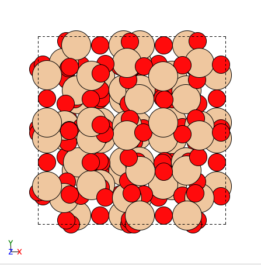
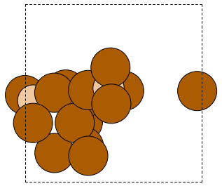
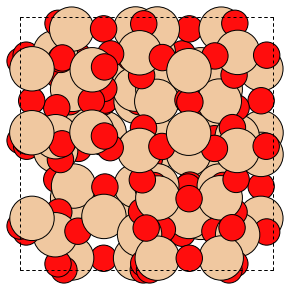
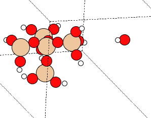
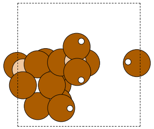
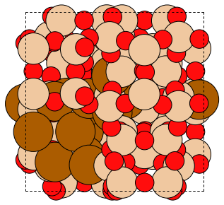

===============
Tutorials
===============

To showcase the capabilities of the MAZE code various tutorials will be presented, along with comments describing how to use the functions shown in the demos.

******************************************************
Cif Fetching from the Database of Zeolite Structures
******************************************************

The `database of zeolite structures <http://www.iza-structure.org/databases/>`_ is a useful resource for zeolite simulation experiments. It contains cif files for all of the synthesized zeolites, organized by their three letter zeolite code. Downloading them from the website is easy when working on a local machine, but challenging when working on a remote machine. To facilitate smoother workflows, a simple python function which downloads cif files from the database was created. An example of using this to download a few different cif files is shown below.

First we import the MAZE package, the glob package, and the ``download_cif`` function from the ``maze.cif_download`` module.

    >>> import maze
    >>> from maze.cif_download import download_cif
    >>> import glob

Next we declare a helper function which prints out all of the directories in the current working directory. This will help us visualize the ``download_cif`` function's behavior.

    >>> def print_dirs():
    ...     print('dirs in cwd',  glob.glob('**/'))
    ...

We can view the directories names in our current directory using our helper function.

    >>> print_dirs()
    dirs in cwd []

Now let us try downloading the GOO cif file, with the ``download_cif`` function. By default the directory that the cif file is downloaded to is `data`. If this 'data' directory doesn't exist, it is created.

    >>> download_cif("GOO") # downloads "GOO.cif" to data/GOO.cif
    >>> print_dirs()
    dirs in cwd ['data/']
    >>> print('files in data dir', glob.glob("data/*"))
    files in data dir ['data/goo.cif']

The function worked, and now the cif file is just where we want it. If we want to download it to a custom location, we can do that as well by specifying this

    >>> download_cif("off", data_dir="my_other_data")
    >>> print_dirs()
    dirs in cwd ['my_other_data/', 'data/']
    >>> print('files in my_other_data dir', glob.glob("my_other_data/*"))
    files in my_other_data dir ['my_other_data/off.cif']

You now know how to use the ``donwload_cif`` function. Hopefully, this will be useful to you.

******************************************************
Building a Zeotype from a cif File
******************************************************

A cif file contains the crystallographic information that defines a zeolite structure. A downloaded from the iza-sc database of zeolite strucutres looks like this:

.. code-block:: text

    data_cha
    #**************************************************************************
    #
    # cif taken from the iza-sc database of zeolite structures
    # ch. baerlocher and l.b. mccusker
    # database of zeolite structures: http://www.iza-structure.org/databases/
    #
    # the atom coordinates and the cell parameters were optimized with dls76
    # assuming a pure sio2 composition.
    #
    #**************************************************************************

    _cell_length_a                  13.6750(0)
    _cell_length_b                  13.6750(0)
    _cell_length_c                  14.7670(0)
    _cell_angle_alpha               90.0000(0)
    _cell_angle_beta                90.0000(0)
    _cell_angle_gamma              120.0000(0)

    _symmetry_space_group_name_h-m     'r -3 m'
    _symmetry_int_tables_number         166
    _symmetry_cell_setting             trigonal

    loop_
    _symmetry_equiv_pos_as_xyz
    '+x,+y,+z'
    '2/3+x,1/3+y,1/3+z'
    '1/3+x,2/3+y,2/3+z'
    '-y,+x-y,+z'
    ... skipping all of this info for space
    ...

    loop_
    _atom_site_label
    _atom_site_type_symbol
    _atom_site_fract_x
    _atom_site_fract_y
    _atom_site_fract_z
        o1    o     0.9020    0.0980    0.1227
        o2    o     0.9767    0.3101    0.1667
        o3    o     0.1203    0.2405    0.1315
        o4    o     0.0000    0.2577    0.0000
        t1    si    0.9997    0.2264    0.1051

An important piece of information in this cif file is the _atom_site_label (01, 02, ... t1, t2.. ect.) that is located in the first column of the cif file near the atom position information. This information about the atoms identities is lost when ``ase.io.read`` function is used to build an atoms object form a cif file. Knowing the identity of the T-sites is critical for zeolite simulation experiments. This issue inspired the creation of a custom constructor of the ``Zeotype`` object, ``build_from_cif_with_labels``. This static method creates a ``Zeotype`` object and labels the unique atoms, by tagging them, and storing the mapping between the ``atom_site_label`` and the atom indices in the dictionaries ``self.site_to_atom_indices`` and ``self.atom_indices_to_site``.

To demonstrate this feature, let us try building a ``Zeotype`` object from a cif file.

First we import the MAZE package.

    >>> import maze
    >>> from maze.cif_download import download_cif
    >>> from maze.zeotypes import Zeotype

Then we download a cif file using the ``download_cif`` function.

    >>> download_cif('cha', data_dir='data') # download cha.cif

We have our cif file so we can now use the static method ``build_from_cif_with_labels`` to build a ``Zeotype`` with labeled

>>> my_zeolite = Zeotype.build_from_cif_with_labels('data/cha.cif')  # build from code

Our ``Zeotype`` has been built. The atom identity information is now stored in two dictionaries. Let us take a look at them:

    >>> print('site_to_atom_indices map', my_zeolite.site_to_atom_indices, sep='\n\n')
    site_to_atom_indices map

.. code-block:: json

    {'o1': [0, 1, 2, 3, 4, 5, 6, 7, 8, 9, 10, 11, 12, 13, 14, 15, 16, 17],
    'o2': [18, 19, 20, 21, 22, 23, 24, 25, 26, 27, 28, 29, 30, 31, 32, 33, 34, 35],
    'o3': [36, 37, 38, 39, 40, 41, 42, 43, 44, 45, 46, 47, 48, 49, 50, 51, 52, 53],
    'o4': [54, 55, 56, 57, 58, 59, 60, 61, 62, 63, 64, 65, 66, 67, 68, 69, 70, 71],
    't1': [72, 73, 74, 75, 76, 77, 78, 79, 80, 81, 82, 83, 84, 85, 86, 87, 88, 89, 90, 91, 92, 93, 94, 95, 96, 97, 98, 99, 100, 101, 102, 103, 104, 105, 106, 107]}

.. code-block:: python

    >>> print('atom indices to site map', my_zeolite.atom_indices_to_site, sep='\n\n')
    atom indices to site map

.. code-block:: json

    {0: 'o1', 1: 'o1', 2: 'o1', 3: 'o1', 4: 'o1', 5: 'o1', 6: 'o1', 7: 'o1', 8: 'o1', 9: 'o1', 10: 'o1', 11: 'o1', 12: 'o1', 13: 'o1', 14: 'o1', 15: 'o1', 16: 'o1', 17: 'o1', 18: 'o2', 19: 'o2', 20: 'o2', 21: 'o2', 22: 'o2', 23: 'o2', 24: 'o2', 25: 'o2', 26: 'o2', 27: 'o2', 28: 'o2', 29: 'o2', 30: 'o2', 31: 'o2', 32: 'o2', 33: 'o2', 34: 'o2', 35: 'o2', 36: 'o3', 37: 'o3', 38: 'o3', 39: 'o3', 40: 'o3', 41: 'o3', 42: 'o3', 43: 'o3', 44: 'o3', 45: 'o3', 46: 'o3', 47: 'o3', 48: 'o3', 49: 'o3', 50: 'o3', 51: 'o3', 52: 'o3', 53: 'o3', 54: 'o4', 55: 'o4', 56: 'o4', 57: 'o4', 58: 'o4', 59: 'o4', 60: 'o4', 61: 'o4', 62: 'o4', 63: 'o4', 64: 'o4', 65: 'o4', 66: 'o4', 67: 'o4', 68: 'o4', 69: 'o4', 70: 'o4', 71: 'o4', 72: 't1', 73: 't1', 74: 't1', 75: 't1', 76: 't1', 77: 't1', 78: 't1', 79: 't1', 80: 't1', 81: 't1', 82: 't1', 83: 't1', 84: 't1', 85: 't1', 86: 't1', 87: 't1', 88: 't1', 89: 't1', 90: 't1', 91: 't1', 92: 't1', 93: 't1', 94: 't1', 95: 't1', 96: 't1', 97: 't1', 98: 't1', 99: 't1', 100: 't1', 101: 't1', 102: 't1', 103: 't1', 104: 't1', 105: 't1', 106: 't1', 107: 't1'}

Depending on the situation one dictionary might be more useful than the other.

******************************************************
Identifying Atom Types in a Zeolite Structure
******************************************************

The ``Zeotype`` class includes methods for identifying the different types of atoms in a zeolite structure. These methods will work on all ``Zeotype`` objects, even those where the ``atom_indices_to_site`` and ``site_to_atom_indices`` are not set.

.. code-block:: python

    >>> from maze.zeotypes import Zeotype
    >>> cif_dir = "/Users/dda/Code/zeotype/data/GOO.cif"
    >>> z = Zeotype.build_from_cif_with_labels(cif_dir)
    >>> atom_types = z.get_atom_types()
    >>> print('atom_types', dict(atom_types))

.. code-block:: json

    atom_types {'framework-O': [0, 1, 2, 3, 4, 5, 6, 7, 8, 9, 10, 11, 12, 13, 14, 15, 16, 17, 18, 19, 20, 21, 22, 23, 24, 25, 26, 27, 28, 29, 30, 31, 32, 33, 34, 35, 36, 37, 38, 39, 40, 41, 42, 43, 44, 45, 46, 47, 48, 49, 50, 51, 52, 53, 54, 55, 56, 57, 58, 59, 60, 61, 62, 63], 'framework-Si': [64, 65, 66, 67, 68, 69, 70, 71, 72, 73, 74, 75, 76, 77, 78, 79, 80, 81, 82, 83, 84, 85, 86, 87, 88, 89, 90, 91, 92, 93, 94, 95]}

.. code-block:: python

    >>> atoms_indices, count = z.count_elements()
    >>> print('atom type count', dict(atoms_indices))

.. code-block:: json

    atom type count {'O': [0, 1, 2, 3, 4, 5, 6, 7, 8, 9, 10, 11, 12, 13, 14, 15, 16, 17, 18, 19, 20, 21, 22, 23, 24, 25, 26, 27, 28, 29, 30, 31, 32, 33, 34, 35, 36, 37, 38, 39, 40, 41, 42, 43, 44, 45, 46, 47, 48, 49, 50, 51, 52, 53, 54, 55, 56, 57, 58, 59, 60, 61, 62, 63], 'Si': [64, 65, 66, 67, 68, 69, 70, 71, 72, 73, 74, 75, 76, 77, 78, 79, 80, 81, 82, 83, 84, 85, 86, 87, 88, 89, 90, 91, 92, 93, 94, 95]}

.. code-block:: python

    print('atom count', dict(atoms_indices))

.. code-block:: json

    atom type count {'O': [0, 1, 2, 3, 4, 5, 6, 7, 8, 9, 10, 11, 12, 13, 14, 15, 16, 17, 18, 19, 20, 21, 22, 23, 24, 25, 26, 27, 28, 29, 30, 31, 32, 33, 34, 35, 36, 37, 38, 39, 40, 41, 42, 43, 44, 45, 46, 47, 48, 49, 50, 51, 52, 53, 54, 55, 56, 57, 58, 59, 60, 61, 62, 63], 'Si': [64, 65, 66, 67, 68, 69, 70, 71, 72, 73, 74, 75, 76, 77, 78, 79, 80, 81, 82, 83, 84, 85, 86, 87, 88, 89, 90, 91, 92, 93, 94, 95]}

******************************************************
Extracting, Adding and Capping Clusters
******************************************************

One of the most useful features of the MAZE package is the ability to add and remove atoms from a ``Zeotype`` object. To demonstrate this we will extract a cluster from an ``ImperfectZeotype`` object, change some of the atoms, then integrate it back into the main ``ImperfectZeotype``.

First we load in the MAZE package and set the path of our cif file to the variable ``cif_dir``.

.. code-block:: python

    >>> import maze
    >>> cif_dir = "/users/dda/code/zeotype/data/bea.cif"

Next we build a ``Zeotype`` object from a cif file

.. code-block:: python

    >>> zeolite = maze.zeotypes.Zeotype.build_from_cif_with_labels(cif_dir)

To view the zeolite structure we use the ``ase.visualize.view`` function.

.. code-block:: python

    >>> from ase.visualize import view
    >>> view(zeolite)

The next step is to pick a T-site and then use one of the static methods in the ``Cluster`` class to select indices to build the cluster.

The atom 154 is right in the middle of the zeolite, which will make viewing the cluster creation easy. Another option would be to use the ``site_to_atom_indices`` dictionary to select a specific T site.

There are a few different cluster index finder functions to choose from. A simple one is ``Cluster.get_oh_cluster_indices`` which only selects the central t atom, and surrounding oxygen and hydrogens.

.. code-block:: python

    >>> site = 154
    >>> cluster_indices = maze.zeotypes.Cluster.get_oh_cluster_indices(zeolite, site)
    >>> cluster_indices
    [2, 66, 74, 138, 77, 82, 146, 22, 154, 30, 38, 102, 186, 42, 174, 50, 114, 117, 118, 58, 126]

Now that we have selected the indices we can create a cluster and open framework using the ``zeotype`` method ``get_cluster``

.. code-block:: python

    >>> cluster, open_framework = zeolite.get_cluster(cluster_indices=cluster_indices)
    >>> view(cluster)

.. code-block:: python

    >>> view(open_framework)

Next we want to cap the cluster and optimize its structure. Capping involves adding hydrogens and oxygens to the cluster. The built-in ``cap_atoms()`` method returns a new cluster object that has hydrogen caps added to it.

    >>> capped_cluster = cluster.cap_atoms()
    >>> view(capped_cluster)

The next step is to replace the oxygen atoms in the capped_cluster with Po atoms.

.. code-block:: python

    >>> for atom in capped_cluster:
    >>>     if atom.symbol == 'O':
    >>>         capped_cluster[atom.index].symbol = 'Po'
    >>> view(capped_cluster)

Now we remove the caps. To do this we examine the additions dictionary.

.. code-block:: python

    >>> capped_cluster.additions
    defaultdict(<class 'list'>, {'h_caps': ['h_caps_6']})

The caps are in the category ``h_caps`` and have the name ``h_caps_6``. With this information we can remove them from the cluster.

.. code-block:: python

   >>>  uncapped_cluster = capped_cluster.remove_caps(cap_type='h_caps', cap_name='h_caps_6')
   >>> view(uncapped_cluster)

Finally we integrate the cluster back into the open framework. If the cluster has overlapping indices with the zeotype it is being integrated into, then the properties of those overlapping atoms will be changed to match the cluster being integrated.

.. code-block:: python

        iz = open_framework.integrate_other_zeotype(uncapped_cluster)
        view(iz)

This demo showed the power of the ZeoSE code to extract and add clusters to zeotypes. This is one of the most useful features of the ZeoSE code.